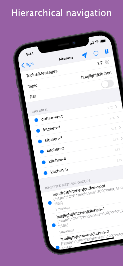
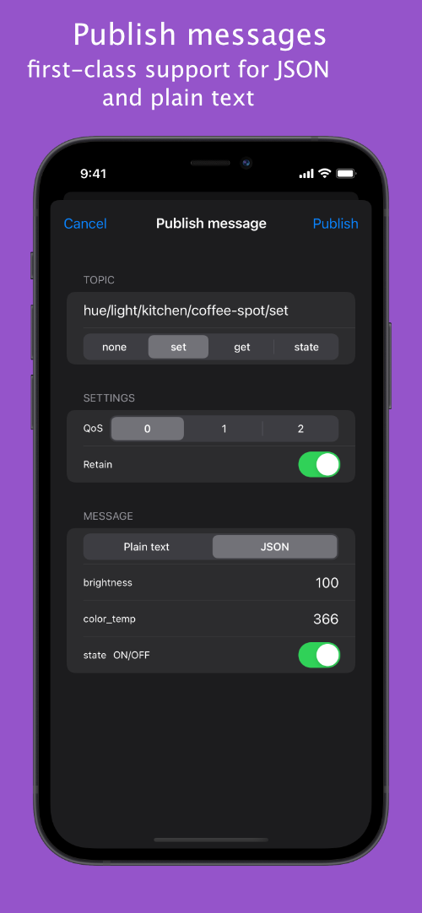
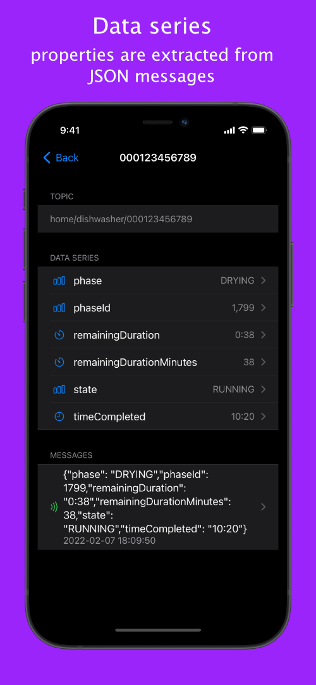
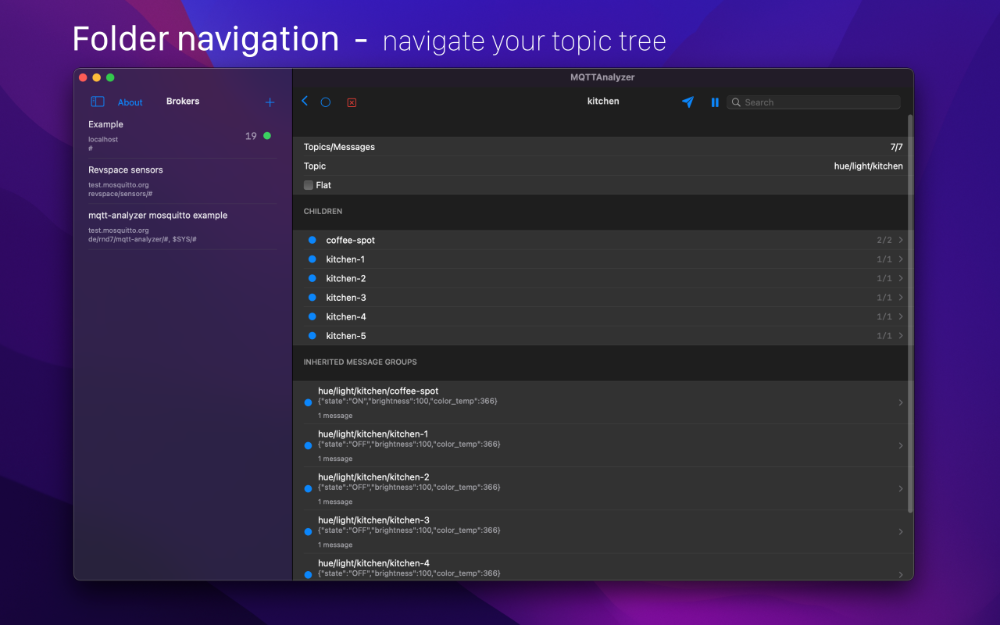
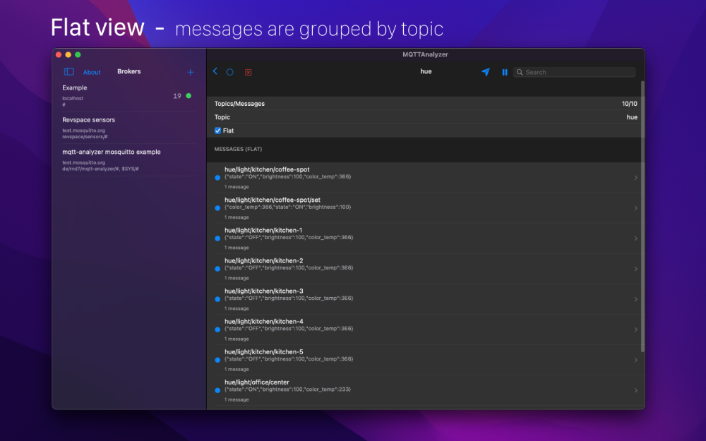

# mqtt-analyzer

MQTTAnalyzer is an iOS App that allows to connect to your MQTT Broker and
subscribe to a topic. It is written in Swift using SwiftUI.

This App is open source, contributions are welcome.

Features:
- authentication with username/password or client certificates
- connect using MQTT or Websocket
- support for SSL/TLS
- support for self signed certificates
- create multiple broker settings
- messages are grouped by topic
- search/filter/focus-on for topics
- json highlighting and pretty printing
- publish messages
- publish json messages with a form
- sync settings using private iCloud database
- pause the connection
- connect to multiple brokers at once
- totally free and no ADs
- open source

# TestFlight

You can TestFlight the latest beta version using this link:
https://testflight.apple.com/join/dsvlFCPU

# Screenshots

## iOS

## macOS

# Examples

## AWS Iot

see [Create a certificate for AWS IoT](examples/aws/README)

## Traefik + Mosquitto + Let's Encrypt

see [Traefik + Mosquitto + Let's Encrypt](examples/traefik-tls/README)

# Developer notes

| Description           | Command           |
| --------------------- | ----------------- |
| Update pod repos      | `pod repo update` |
| Install / update pods | `pod install`     |
| Execute test cases    | `run-tests.sh`    |

## Realm on macOS
In case you get the error `Umbrella header 'Realm.h' not found` when creating an archive see:
https://github.com/realm/realm-swift/issues/3556#issuecomment-218990100

- Right click on `Pods/Realm/Headers/Realm` / Show file inspector
- Set target member to `Public`
- Do this for all header files (multi selection is possible)

