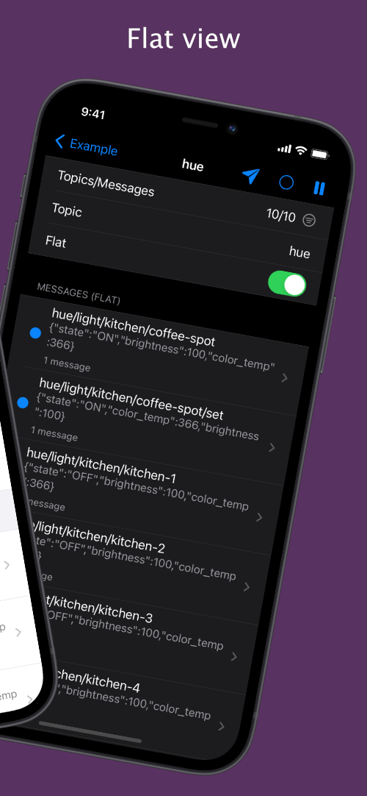
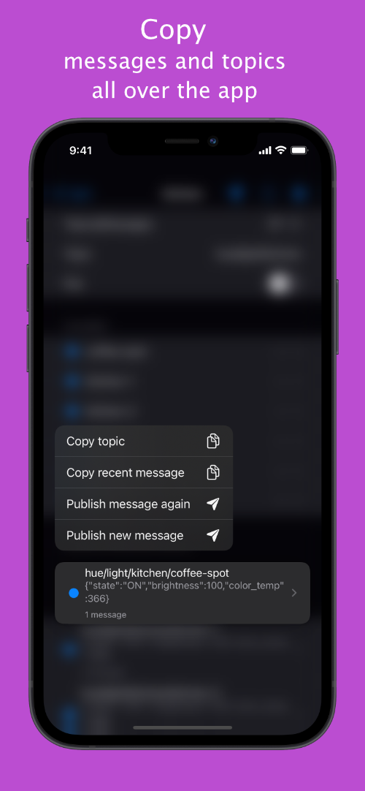

# mqtt-analyzer

With MQTTAnalyzer you can connect to your MQTT Broker and
subscribe to a topic.

Features:
- create multiple broker settings
- messages are grouped by topic
- search/filter/focus-on for topics
- json highlighting and pretty printing
- post messages
- post json messages with a form
- sync settings using private iCloud database
- pause the connection

